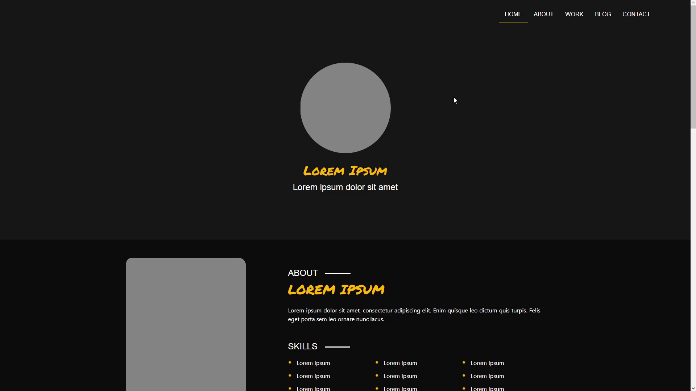
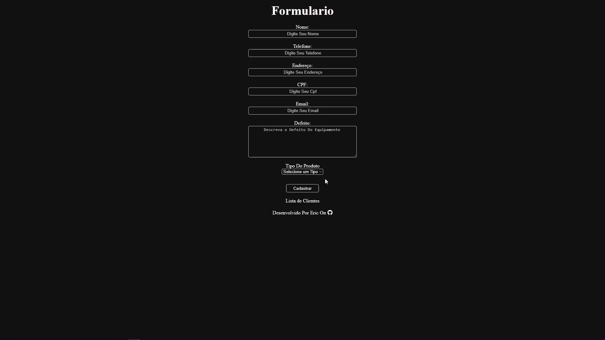

<!--  -->

<picture>
  <source media="(prefers-color-scheme: dark)" srcset="img/EN/Dark/Eric.svg">
  <source media="(prefers-color-scheme: light)" srcset="img/EN/Light/Eric.svg">
    
</picture>

"Hello, my name is Eric. I'm 22 years old and, since I got my first computer when I was 6 years old, I was fascinated by technology, starting to study hardware, focusing my studies in this area until the end of high school. Upon joining College of Systems Analysis and Development, I decided to dedicate myself to Software Development, with a focus on Front-End. I'm currently in the 5th Semester of College, dedicating myself to improving my skills in Programming and Design. Outside of College, I like spending time My Free Time Working On Personal Projects And Learning New Technologies."

<!-- social midia -->
<picture>
  <source media="(prefers-color-scheme: dark)" srcset="img/EN/Dark/SocialMedia.svg">
  <source media="(prefers-color-scheme: light)" srcset="img/EN/Light/SocialMedia.svg">
    
</picture>

   

<!-- skills -->

<picture>
  <source media="(prefers-color-scheme: dark)" srcset="img/EN/Dark/Skills.svg">
  <source media="(prefers-color-scheme: light)" srcset="img/EN/Light/Skills.svg">
    
</picture>

 

<picture>
  <source media="(prefers-color-scheme: dark)" srcset="img/EN/Dark/LanguagesFrontEnd.svg">
  <source media="(prefers-color-scheme: light)" srcset="img/EN/Light/LanguagesFrontEnd.svg">
    
</picture>

  

<picture>
  <source media="(prefers-color-scheme: dark)" srcset="img/EN/Dark/LanguagesBackEnd.svg">
  <source media="(prefers-color-scheme: light)" srcset="img/EN/Light/LanguagesBackEnd.svg">
    
</picture>

    

<picture>
  <source media="(prefers-color-scheme: dark)" srcset="img/EN/Dark/FrameworksFrontEnd.svg">
  <source media="(prefers-color-scheme: light)" srcset="img/EN/Light/FrameworksFrontEnd.svg">
    
</picture>

  

<picture>
  <source media="(prefers-color-scheme: dark)" srcset="img/EN/Dark/FrameworksBackEnd.svg">
  <source media="(prefers-color-scheme: light)" srcset="img/EN/Light/FrameworksBackEnd.svg">
    
</picture>

 

<picture>
  <source media="(prefers-color-scheme: dark)" srcset="img/EN/Dark/DataBase.svg">
  <source media="(prefers-color-scheme: light)" srcset="img/EN/Light/DataBase.svg">
    
</picture>

  

<picture>
  <source media="(prefers-color-scheme: dark)" srcset="img/EN/Dark/Design.svg">
  <source media="(prefers-color-scheme: light)" srcset="img/EN/Light/Design.svg">
    
</picture>

  

<picture>
  <source media="(prefers-color-scheme: dark)" srcset="img/EN/Dark/Project.svg">
  <source media="(prefers-color-scheme: light)" srcset="img/EN/Light/Project.svg">
    
</picture>

<!-- Rich And Morty -->

 

<picture>
  <source media="(prefers-color-scheme: dark)" srcset="img/EN/Dark/RickAndMorty.svg">
  <source media="(prefers-color-scheme: light)" srcset="img/EN/Light/RickAndMorty.svg">
    
</picture>

A Project Developed With The Objective Of Practicing The Use Of The Vue.js Framework Consuming Rick And Norty's Public API Using Axios For API Requests And Tailwindcss For Styling. In The Project It Is Possible To See All The Characters In The Series, Search By Name And Filter Them By Status, Gender And Species.

<!-- RideShare Bot-->

 

<picture>
  <source media="(prefers-color-scheme: dark)" srcset="img/EN/Dark/RideShare.svg">
  <source media="(prefers-color-scheme: light)" srcset="img/EN/Light/RideShare.svg">
    
</picture>

Registration System For College Carpools Made In Python With SQLite Database And Discord Library, It Is Possible To Register Carpool, Delete Carpool And Check In A Table How Much Should Be Paid For Each Driver.

<!-- Assitencia Tecnica Spring Vue API -->

<picture>
  <source media="(prefers-color-scheme: dark)" srcset="img/EN/Dark/TechnicalAssistanceSpringVueAPI.svg">
  <source media="(prefers-color-scheme: light)" srcset="img/EN/Light/TechnicalAssistanceSpringVueAPI.svg">
    
</picture>

CRUD System For Fictitious Technical Assistance, Made In HTML, CSS, Java And MySQL, The Spring And Vue Framework Was Used. Allows Registration, Reading, Updating And Deleting Records In cards.

<!-- Teste Dev Cardume Digital -->

<picture>
  <source media="(prefers-color-scheme: dark)" srcset="img/EN/Dark/TestDevCardumeDigital.svg">
  <source media="(prefers-color-scheme: light)" srcset="img/EN/Light/TestDevCardumeDigital.svg">
    
</picture>

Layout Replication Proposed By Cardume Digital In Test For Front-end Developer, With HTML, CSS, JS And Bootstrap 5.

<!-- Layout da Louna Skylander -->

<picture>
  <source media="(prefers-color-scheme: dark)" srcset="img/EN/Dark/LounaSkylanderLayout.svg">
  <source media="(prefers-color-scheme: light)" srcset="img/EN/Light/LounaSkylanderLayout.svg">
    
</picture>

Project Based On The Louna Skylander Layout, With The Main Objective Of Practical Study Of The Bootstrap 5 Framework.

<!-- Assitencia Tecnica - Spring -->

<picture>
  <source media="(prefers-color-scheme: dark)" srcset="img/EN/Dark/TechnicalAssistanceThymeleaf.svg">
  <source media="(prefers-color-scheme: light)" srcset="img/EN/Light/TechnicalAssistanceThymeleaf.svg">
    
</picture>

CRUD System For Fictitious Technical Assistance, Made In HTML, CSS, Java And MySQL, The Spring Framework Was Used. Allows Registration, Reading, Updating And Deleting Records In The Table.

<!-- Assistencia Tecnica - Laravel -->

<picture>
  <source media="(prefers-color-scheme: dark)" srcset="img/EN/Dark/TechnicalAssistanceLaravel.svg">
  <source media="(prefers-color-scheme: light)" srcset="img/EN/Light/TechnicalAssistanceLaravel.svg">
    
</picture>

CRUD System For Fictitious Technical Assistance, Made In HTML, CSS, PHP And MySQL, The Laravel Framework Was Used. Allows Registration, Reading, Updating And Deleting Records In The Table.

<!-- Assistencia Tecnica - Poo -->

<picture>
  <source media="(prefers-color-scheme: dark)" srcset="img/EN/Dark/TechnicalAssistancePoo.svg">
  <source media="(prefers-color-scheme: light)" srcset="img/EN/Light/TechnicalAssistancePoo.svg">
    
</picture>

CRUD System For Fictitious Technical Assistance, Made In HTML, CSS, PHP With Object Oriented Programming And MySQL. Allows Registration, Reading, Updating And Deleting Records In The Table.

<!-- Sistema De Crud -->

<picture>
  <source media="(prefers-color-scheme: dark)" srcset="img/EN/Dark/CrudSystem.svg">
  <source media="(prefers-color-scheme: light)" srcset="img/EN/Light/CrudSystem.svg">
    
</picture>

CRUD System For Fictitious Technical Assistance, Made In HTML, CSS, PHP And MySQL. Allows Registration, Reading, Updating And Deletion Of Records In The Table.

<!-- Clone Tesla Cars -->

<picture>
  <source media="(prefers-color-scheme: dark)" srcset="img/EN/Dark/CloneTeslaCars.svg">
  <source media="(prefers-color-scheme: light)" srcset="img/EN/Light/CloneTeslaCars.svg">
    
</picture>

HTML/CSS Clone Of The Tesla Website, Displaying Car Models With Emphasis On Cybertruck And Semitruck.

<!-- Clone Lolja -->

<picture>
  <source media="(prefers-color-scheme: dark)" srcset="img/EN/Dark/CloneLolja.svg">
  <source media="(prefers-color-scheme: light)" srcset="img/EN/Light/CloneLolja.svg">
    
</picture>

HTML/CSS Clone Of The Lolja Website, Featuring Featured Product Cards With Name, Image And Value.

<!-- Atlas Covid -->

<picture>
  <source media="(prefers-color-scheme: dark)" srcset="img/EN/Dark/AtlasCovid.svg">
  <source media="(prefers-color-scheme: light)" srcset="img/EN/Light/AtlasCovid.svg">
    
</picture>

My First Project In Web Development Displays Data About COVID-19 In A Table, Informative Videos, Questions And Answers. Made With HTML And CSS.

