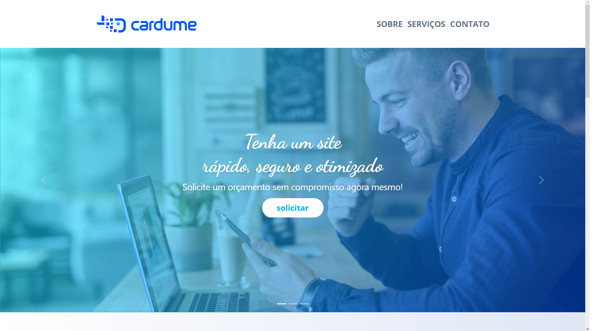
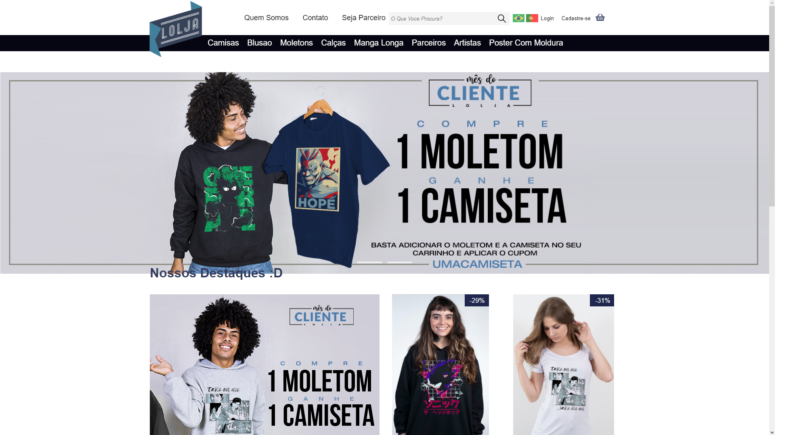

<!-- CSS BootStrap -->
<link href="https://cdn.jsdelivr.net/npm/bootstrap@5.2.2/dist/css/bootstrap.min.css" rel="stylesheet" integrity="sha384-Zenh87qX5JnK2Jl0vWa8Ck2rdkQ2Bzep5IDxbcnCeuOxjzrPF/et3URy9Bv1WTRi" crossorigin="anonymous">

<!-- Icons BootStrap -->
<link rel="stylesheet" href="https://cdn.jsdelivr.net/npm/bootstrap-icons@1.10.2/font/bootstrap-icons.css">

<!-- JavaScript BootStrap-->

<main class="d-flex justify-content-center align-items-center w-100 flex-column">

<!-- About -->
<section class="text-center">

<h1>Eric<i class="bi bi-person-fill ms-2"></i></h1>

<section class="d-flex justify-content-center align-items-center w-100 mt-2">

Olá, meu nome é Eric. Tenho 21 anos e, desde que ganhei meu primeiro computador aos 6 anos de idade, fiquei fascinado por tecnologia começando a estudar hardware, focando meus estudos nessa área até o final do ensino médio. Ao entrar para a faculdade de análise e desenvolvimento de sistemas, decidi me dedicar ao desenvolvimento de software, com foco em front-end. Atualmente estou no 5º semestre da faculdade, dedicando-me a aprimorar minhas habilidades em programação e design. Fora da faculdade, gosto de passar meu tempo livre trabalhando em projetos pessoais e aprendendo novas tecnologias.

</section>

</section>

<!-- Social -->
<section class="text-center">

<h1>Redes Sociais <i class="bi bi-emoji-smile-fill"></i></h1>

<section class="d-flex justify-content-center align-items-center w-100 gap-3 mt-2">

</section>

</section>

<!-- skills -->

<section class="text-center">

<h1>Habilidades <i class="bi bi-lightbulb-fill"></i></h1>

<section class="d-flex justify-content-center align-items-center w-100 gap-3 mt-3 flex-column">

<h3>Linguagens - Front-end <i class="bi bi-code-slash"></i></h3>

<section class="d-flex justify-content-center align-items-center w-100 gap-3">

</section>

<h3>Linguagens - Back-end <i class="bi bi-braces"></i></h3>

<section class="d-flex justify-content-center align-items-center w-100 gap-3">

</section>

<h3>Frameworks - Front-end <i class="bi bi-code-slash"></i></h3>

<section class="d-flex justify-content-center align-items-center w-100 gap-3">

</section>

<h3>Frameworks - Back-end <i class="bi bi-braces"></i></h3>

<section class="d-flex justify-content-center align-items-center w-100 gap-3">

</section>

<h3>Banco de Dados <i class="bi bi-database-fill"></i></h3>

<section class="d-flex justify-content-center align-items-center w-100 gap-3">

</section>

<h3>Design <i class="bi bi-palette-fill"></i></h3>

<section class="d-flex justify-content-center align-items-center w-100 gap-3">

</section>

</section>

</section>

<!-- Projects -->

  

<section class="text-center">

<h1>Projetos<i class="bi bi-clipboard-fill ms-2"></i></h1>
<!-- card project - start -->
<section class="d-flex justify-content-center align-items-center w-100 mt-3
flex-column flex-md-row">

<section class="d-flex flex-column justify-content-center w-100 ms-0 align-items-center align-items-md-start ms-md-3 mt-3 mt-md-0">

<h3>Rick and Morty</h3>

Um projeto com o objetivo de praticar o framework Vue.js e o consumo de uma API pública. Foi utilizado a API da série <a href="https://rickandmortyapi.com/" class="text-decoration-none text-white" target="_blank">Rick and Morty</a>.

<a href="" class="projectButton text-white text-decoration-none fw-bold" target="_blank">
Acessar <i class="bi bi-link-45deg"></i>
</a>

</section>
</section>

<!-- card project - end -->

<!-- card project - start -->
<section class="d-flex justify-content-center align-items-center w-100 mt-3
flex-column flex-md-row">

<section class="d-flex flex-column justify-content-center w-100 ms-0 align-items-center align-items-md-start ms-md-3 mt-3 mt-md-0">

<h3>Teste Dev Cardume Digital</i></h3>

Replicação de layout proposto pela Cardume Digital em teste para desenvolvedor front-end, com HTML, CSS, JS e Bootstrap 5.

<a href="https://ericrq.github.io/TesteDev-CardumeDigital/" target="_blank" class="projectButton text-white text-decoration-none fw-bold">
Acessar <i class="bi bi-link-45deg"></i>
</a>

</section>
</section>

<!-- card project - end -->

<!-- card project - start -->
<section class="d-flex justify-content-center align-items-center w-100 mt-3
flex-column flex-md-row">

<section class="d-flex flex-column justify-content-center w-100 ms-0 align-items-center align-items-md-start ms-md-3 mt-3 mt-md-0">

<h3>Layout da Louna Skylander</h3>

Projeto baseado no layout da <a  href="https://www.figma.com/community/file/1100769865627589687" target="_blank" class="text-decoration-none text-white">Louna Skylander</a>, com o objetivo principal de estudo prático do framework Bootstrap 5.

<a href="https://ericrq.github.io/ProjetoBootStrap5/" target="_blank" class="projectButton text-white text-decoration-none fw-bold">
Acessar <i class="bi bi-link-45deg"></i>
</a>

</section>
</section>

<!-- card project - end -->

<!-- card project - start -->
<section class="d-flex justify-content-center align-items-center w-100 mt-3
flex-column flex-md-row">

<section class="d-flex flex-column justify-content-center w-100 ms-0 align-items-center align-items-md-start ms-md-3 mt-3 mt-md-0">

<h3>Assitencia Tecnica - Spring</i></h3>

Sistema CRUD para assistência técnica fictícia, feito em HTML, CSS, Java e MySQL foi utilizado o framework Spring. Permite cadastro, leitura, atualização e exclusão de registros na tabela

<a href="https://github.com/ericrq/ProjetoAssitenciaTenicaJavaSpring" class="projectButton text-white text-decoration-none fw-bold" target="_blank">
Acessar <i class="bi bi-link-45deg"></i>
</a>

</section>
</section>

<!-- card project - end -->

<!-- card project - start -->
<section class="d-flex justify-content-center align-items-center w-100 mt-3
flex-column flex-md-row">

<section class="d-flex flex-column justify-content-center w-100 ms-0 align-items-center align-items-md-start ms-md-3 mt-3 mt-md-0">

<h3>Assistencia Tecnica - Laravel</i></h3>

Sistema CRUD para assistência técnica fictícia, feito em HTML, CSS, PHP e MySQL foi utilizado o framework Laravel. Permite cadastro, leitura, atualização e exclusão de registros na tabela

<a href="https://github.com/ericrq/ProjetoAssistenciaTecnicaLaravelPHP" class="projectButton text-white text-decoration-none fw-bold" target="_blank">
Acessar <i class="bi bi-link-45deg"></i>
</a>

</section>
</section>

<!-- card project - end -->

<!-- card project - start -->
<section class="d-flex justify-content-center align-items-center w-100 mt-3
flex-column flex-md-row">

<section class="d-flex flex-column justify-content-center w-100 ms-0 align-items-center align-items-md-start ms-md-3 mt-3 mt-md-0">

<h3>Assistencia Tecnica - Poo</i></h3>

Sistema CRUD para assistência técnica fictícia, feito em HTML, CSS, PHP com Programaçao Orientada a Objetos e MySQL. Permite cadastro, leitura, atualização e exclusão de registros na tabela

<a href="https://github.com/ericrq/ProjetoAssistenciaTecnicaPHP" target="_blank" class="projectButton text-white text-decoration-none fw-bold">
Acessar <i class="bi bi-link-45deg"></i>
</a>

</section>
</section>

<!-- card project - end -->

<!-- card project - start -->
<section class="d-flex justify-content-center align-items-center w-100 mt-3
flex-column flex-md-row">

<section class="d-flex flex-column justify-content-center w-100 ms-0 align-items-center align-items-md-start ms-md-3 mt-3 mt-md-0">

<h3>Sistema De Crud</i></h3>

Sistema CRUD para assistência técnica fictícia, feito em HTML, CSS, PHP e MySQL. Permite cadastro, leitura, atualização e exclusão de registros na tabela

<a href="https://github.com/ericrq/Sistema-De-Crud" target="_blank" class="projectButton text-white text-decoration-none fw-bold">
Acessar <i class="bi bi-link-45deg"></i>
</a>

</section>
</section>

<!-- card project - end -->

<!-- card project - start -->
<section class="d-flex justify-content-center align-items-center w-100 mt-3
flex-column flex-md-row">

<section class="d-flex flex-column justify-content-center w-100 ms-0 align-items-center align-items-md-start ms-md-3 mt-3 mt-md-0">

<h3>Clone Tesla Cars</i></h3>

Clone em HTML/CSS do site <a href="http://www.tesla.com" target="_blank" class="text-decoration-none text-white">tesla</a>, exibindo modelos de carros com destaque para Cybertruck e Semitruck.

<a href="https://ericrq.github.io/Projeto-Tesla-Cars/" target="_blank" class="projectButton text-white text-decoration-none fw-bold">
Acessar <i class="bi bi-link-45deg"></i>
</a>

</section>
</section>

<!-- card project - end -->

<!-- card project - start -->
<section class="d-flex justify-content-center align-items-center w-100 mt-3
flex-column flex-md-row">

<section class="d-flex flex-column justify-content-center w-100 ms-0 align-items-center align-items-md-start ms-md-3 mt-3 mt-md-0">

<h3>Clone Lolja</i></h3>

Clone em HTML/CSS do site <a href="lolja.com.br" target="_blank" class="text-decoration-none text-white">lolja</a>, apresentando cards de produtos em destaque com nome, imagem e valor.

<a href="https://ericrq.github.io/Projeto-Lolja/" class="projectButton text-white text-decoration-none fw-bold" target="_blank">
Acessar <i class="bi bi-link-45deg"></i>
</a>

</section>
</section>

<!-- card project - end -->

<!-- card project - start -->
<section class="d-flex justify-content-center align-items-center w-100 mt-3
flex-column flex-md-row">

<section class="d-flex flex-column justify-content-center w-100 ms-0 align-items-center align-items-md-start ms-md-3 mt-3 mt-md-0">

<h3>Atlas Covid</i></h3>

Meu primeiro projeto em Desenvolvimento Web exibe dados sobre COVID-19 em tabela, vídeos informativos, perguntas e respostas. Feito com HTML e CSS.

<a href="https://ericrq.github.io/Projeto-Covid/" target="_blank" class="projectButton text-white text-decoration-none fw-bold">
Acessar <i class="bi bi-link-45deg"></i>
</a>

</section>
</section>

<!-- card project - end -->

</section>

<!-- English -->

<section class="text-center">

<h1 class="d-flex justify-content-center align-items-center w-100">English </h1>

<section class="d-flex justify-content-center align-items-center w-100 mt-3
flex-column flex-md-row">

<a href="/README-en.md" target="_blank" class="projectButton text-white text-decoration-none fw-bold">
Access
</a>

</section>

</section>
</main>