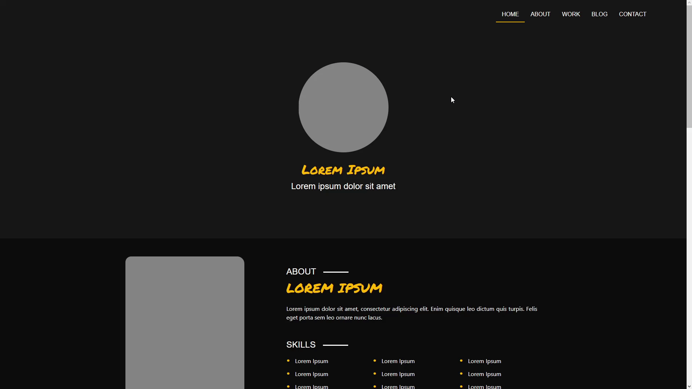
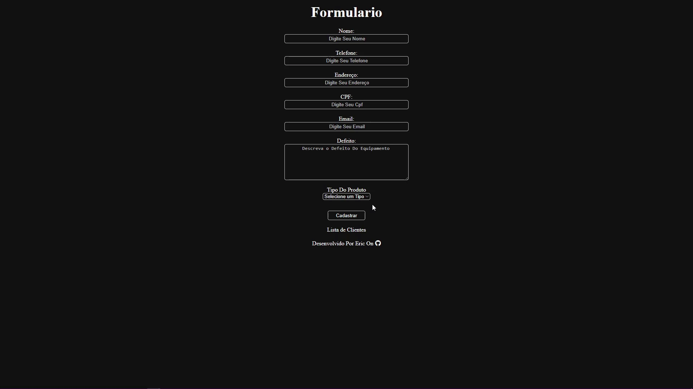

<!--  -->

<picture>
  <source media="(prefers-color-scheme: dark)" srcset="img/BR/Dark/Eric.svg">
  <source media="(prefers-color-scheme: light)" srcset="img/BR/Light/Eric.svg">
    
</picture>

Olá, meu nome é Eric. Tenho 22 anos e, desde que ganhei meu primeiro computador aos 6 anos de idade, fiquei fascinado por tecnologia começando a estudar hardware, focando meus estudos nessa área até o final do ensino médio. Ao entrar para a faculdade de análise e desenvolvimento de sistemas, decidi me dedicar ao desenvolvimento de software, com foco em front-end. Atualmente estou no 5º semestre da faculdade, dedicando-me a aprimorar minhas habilidades em programação e design. Fora da faculdade, gosto de passar meu tempo livre trabalhando em projetos pessoais e aprendendo novas tecnologias.

<!-- social midia -->
<picture>
  <source media="(prefers-color-scheme: dark)" srcset="img/BR/Dark/SocialMedia.svg">
  <source media="(prefers-color-scheme: light)" srcset="img/BR/Light/SocialMedia.svg">
    
</picture>

   

<!-- skills -->

<picture>
  <source media="(prefers-color-scheme: dark)" srcset="img/BR/Dark/Skills.svg">
  <source media="(prefers-color-scheme: light)" srcset="img/BR/Light/Skills.svg">
    
</picture>

 
<picture>
  <source media="(prefers-color-scheme: dark)" srcset="img/BR/Dark/LanguagesFrontEnd.svg">
  <source media="(prefers-color-scheme: light)" srcset="img/BR/Light/LanguagesFrontEnd.svg">
    
</picture>

  

<picture>
  <source media="(prefers-color-scheme: dark)" srcset="img/BR/Dark/LanguagesBackEnd.svg">
  <source media="(prefers-color-scheme: light)" srcset="img/BR/Light/LanguagesBackEnd.svg">
    
</picture>

    

<picture>
  <source media="(prefers-color-scheme: dark)" srcset="img/BR/Dark/FrameworksFrontEnd.svg">
  <source media="(prefers-color-scheme: light)" srcset="img/BR/Light/FrameworksFrontEnd.svg">
    
</picture>

  

<picture>
  <source media="(prefers-color-scheme: dark)" srcset="img/BR/Dark/FrameworksBackEnd.svg">
  <source media="(prefers-color-scheme: light)" srcset="img/BR/Light/FrameworksBackEnd.svg">
    
</picture>

 

<picture>
  <source media="(prefers-color-scheme: dark)" srcset="img/BR/Dark/DataBase.svg">
  <source media="(prefers-color-scheme: light)" srcset="img/BR/Light/DataBase.svg">
    
</picture>

  

<picture>
  <source media="(prefers-color-scheme: dark)" srcset="img/BR/Dark/Design.svg">
  <source media="(prefers-color-scheme: light)" srcset="img/BR/Light/Design.svg">
    
</picture>

  

<picture>
  <source media="(prefers-color-scheme: dark)" srcset="img/BR/Dark/Project.svg">
  <source media="(prefers-color-scheme: light)" srcset="img/BR/Light/Project.svg">
    
</picture>

 

<!-- RideShare Bot-->

<picture>
  <source media="(prefers-color-scheme: dark)" srcset="img/BR/Dark/RideShare.svg">
  <source media="(prefers-color-scheme: light)" srcset="img/BR/Light/RideShare.svg">
    
</picture>

Sistema De Registro Para Caronas Da Faculdade Feito Em Python Com Banco De Dados SQLite E A Biblioteca Do Discord, É Possivel Registrar Carona, Deletar Carona E Verificar Em Uma Tabela Quanto Deve Ser Pago Para Cada Motorista.

<!-- Assitencia Tecnica Spring Vue API -->

<picture>
  <source media="(prefers-color-scheme: dark)" srcset="img/BR/Dark/TechnicalAssistanceSpringVueAPI.svg">
  <source media="(prefers-color-scheme: light)" srcset="img/BR/Light/TechnicalAssistanceSpringVueAPI.svg">
    
</picture>

Sistema CRUD para assistência técnica fictícia, feito em HTML, CSS, Java e MySQL foi utilizado o framework Spring E Vue. Permite cadastro, leitura, atualização e exclusão de registros nos cards.

<!-- Teste Dev Cardume Digital -->

<picture>
  <source media="(prefers-color-scheme: dark)" srcset="img/BR/Dark/TestDevCardumeDigital.svg">
  <source media="(prefers-color-scheme: light)" srcset="img/BR/Light/TestDevCardumeDigital.svg">
    
</picture>

Replicação de layout proposto pela Cardume Digital em teste para desenvolvedor front-end, com HTML, CSS, JS e Bootstrap 5.

<!-- Layout da Louna Skylander -->

<picture>
  <source media="(prefers-color-scheme: dark)" srcset="img/BR/Dark/LounaSkylanderLayout.svg">
  <source media="(prefers-color-scheme: light)" srcset="img/BR/Light/LounaSkylanderLayout.svg">
    
</picture>

Projeto baseado no layout da Louna Skylander, com o objetivo principal de estudo prático do framework Bootstrap 5.

<!-- Assitencia Tecnica - Spring -->

<picture>
  <source media="(prefers-color-scheme: dark)" srcset="img/BR/Dark/TechnicalAssistanceThymeleaf.svg">
  <source media="(prefers-color-scheme: light)" srcset="img/BR/Light/TechnicalAssistanceThymeleaf.svg">
    
</picture>

Sistema CRUD para assistência técnica fictícia, feito em HTML, CSS, Java e MySQL foi utilizado o framework Spring. Permite cadastro, leitura, atualização e exclusão de registros na tabela

<!-- Assistencia Tecnica - Laravel -->

<picture>
  <source media="(prefers-color-scheme: dark)" srcset="img/BR/Dark/TechnicalAssistanceLaravel.svg">
  <source media="(prefers-color-scheme: light)" srcset="img/BR/Light/TechnicalAssistanceLaravel.svg">
    
</picture>

Sistema CRUD para assistência técnica fictícia, feito em HTML, CSS, PHP e MySQL foi utilizado o framework Laravel. Permite cadastro, leitura, atualização e exclusão de registros na tabela

<!-- Assistencia Tecnica - Poo -->

<picture>
  <source media="(prefers-color-scheme: dark)" srcset="img/BR/Dark/TechnicalAssistancePoo.svg">
  <source media="(prefers-color-scheme: light)" srcset="img/BR/Light/TechnicalAssistancePoo.svg">
    
</picture>

Sistema CRUD para assistência técnica fictícia, feito em HTML, CSS, PHP com Programaçao Orientada a Objetos e MySQL. Permite cadastro, leitura, atualização e exclusão de registros na tabela

<!-- Sistema De Crud -->

<picture>
  <source media="(prefers-color-scheme: dark)" srcset="img/BR/Dark/CrudSystem.svg">
  <source media="(prefers-color-scheme: light)" srcset="img/BR/Light/CrudSystem.svg">
    
</picture>

Sistema CRUD para assistência técnica fictícia, feito em HTML, CSS, PHP e MySQL. Permite cadastro, leitura, atualização e exclusão de registros na tabela

<!-- Clone Tesla Cars -->

<picture>
  <source media="(prefers-color-scheme: dark)" srcset="img/BR/Dark/CloneTeslaCars.svg">
  <source media="(prefers-color-scheme: light)" srcset="img/BR/Light/CloneTeslaCars.svg">
    
</picture>

Clone em HTML/CSS do site tesla, exibindo modelos de carros com destaque para Cybertruck e Semitruck.

<!-- Clone Lolja -->

<picture>
  <source media="(prefers-color-scheme: dark)" srcset="img/BR/Dark/CloneLolja.svg">
  <source media="(prefers-color-scheme: light)" srcset="img/BR/Light/CloneLolja.svg">
    
</picture>

Clone em HTML/CSS do site lolja, apresentando cards de produtos em destaque com nome, imagem e valor.

<!-- Atlas Covid -->

<picture>
  <source media="(prefers-color-scheme: dark)" srcset="img/BR/Dark/AtlasCovid.svg">
  <source media="(prefers-color-scheme: light)" srcset="img/BR/Light/AtlasCovid.svg">
    
</picture>

Meu primeiro projeto em Desenvolvimento Web exibe dados sobre COVID-19 em tabela, vídeos informativos, perguntas e respostas. Feito com HTML e CSS.

<!-- eng version -->

<picture>
  <source media="(prefers-color-scheme: dark)" srcset="img/EN/Dark/English.svg">
  <source media="(prefers-color-scheme: light)" srcset="img/EN/Light/English.svg">
    
</picture>
 

