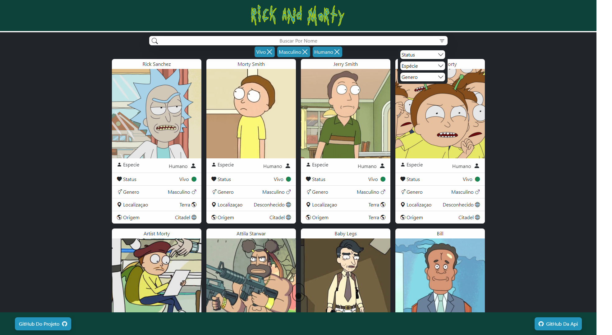
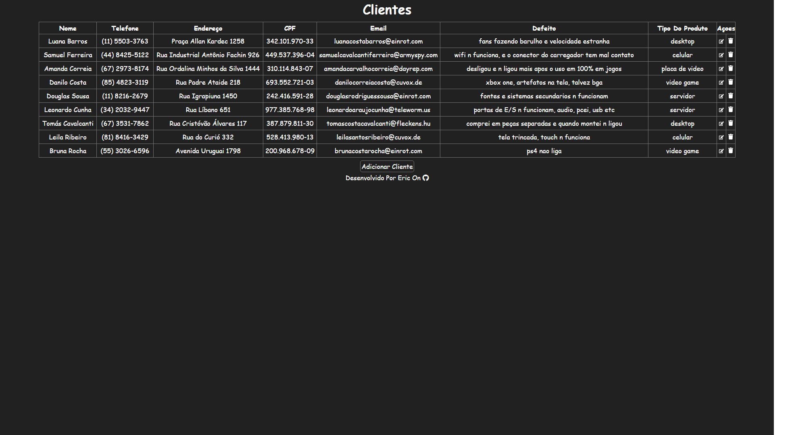
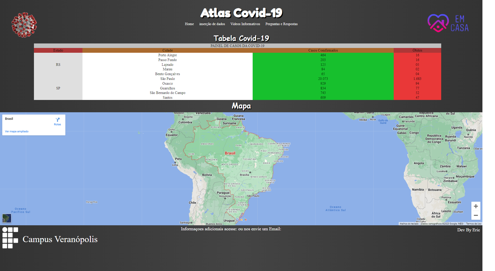

Olá, meu nome é Eric. Tenho 21 anos e, desde que ganhei meu primeiro computador aos 6 anos de idade, fiquei fascinado por tecnologia começando a estudar hardware, focando meus estudos nessa área até o final do ensino médio. Ao entrar para a faculdade de análise e desenvolvimento de sistemas, decidi me dedicar ao desenvolvimento de software, com foco em front-end. Atualmente estou no 5º semestre da faculdade, dedicando-me a aprimorar minhas habilidades em programação e design. Fora da faculdade, gosto de passar meu tempo livre trabalhando em projetos pessoais e aprendendo novas tecnologias.

<!-- social midia -->
 

   

<!-- skills -->

 

  

   

 

 

 

  

 

<!-- rickandmorty -->

<h3>Projeto Rick and Morty</h3>

<dl><dd>
    <dl><dd>
        <dl><dd>
            <dl><dd>
                

                    Um projeto com o objetivo de praticar o framework Vue.js e o consumo de uma API pública. Foi utilizado a API da série Rick and Morty.
                
      
            </dl></dd>
        </dl></dd>
    </dl></dd>
</dl></dd>

  

<!-- Teste Dev Cardume Digital -->

<h3>Teste Dev Cardume Digital</h3>

Replicação de layout proposto pela Cardume Digital em teste para desenvolvedor front-end, com HTML, CSS, JS e Bootstrap 5.

  

<!-- Layout da Louna Skylander -->

<h3>Layout da Louna Skylander</h3>

Projeto baseado no layout da Louna Skylander, com o objetivo principal de estudo prático do framework Bootstrap 5.

  

<!-- Assitencia Tecnica - Spring -->
<h3>Assitencia Tecnica - Spring</h3>

Sistema CRUD para assistência técnica fictícia, feito em HTML, CSS, Java e MySQL foi utilizado o framework Spring. Permite cadastro, leitura, atualização e exclusão de registros na tabela

  

<!-- Assistencia Tecnica - Laravel -->
<<<<<<< HEAD
<h3>Assistencia Tecnica - Laravel
</h3>
=======
<h3>Assistencia Tecnica - Laravel</h3>
>>>>>>> f5802cd885756212577dad2cdfd534e8b3aa0f93

Sistema CRUD para assistência técnica fictícia, feito em HTML, CSS, PHP e MySQL foi utilizado o framework Laravel. Permite cadastro, leitura, atualização e exclusão de registros na tabela

  

<!-- Assistencia Tecnica - Poo -->
<h3>Assistencia Tecnica - Poo</h3>

Sistema CRUD para assistência técnica fictícia, feito em HTML, CSS, PHP com Programaçao Orientada a Objetos e MySQL. Permite cadastro, leitura, atualização e exclusão de registros na tabela

  

<!-- Sistema De Crud -->
<h3>Sistema De Crud</h3>

Sistema CRUD para assistência técnica fictícia, feito em HTML, CSS, PHP e MySQL. Permite cadastro, leitura, atualização e exclusão de registros na tabela

  

<!-- Clone Tesla Cars -->
<h3>Clone Tesla Cars</h3>

Clone em HTML/CSS do site tesla, exibindo modelos de carros com destaque para Cybertruck e Semitruck.

  

<!-- Clone Lolja -->
<h3>Clone Lolja</h3>

Clone em HTML/CSS do site lolja, apresentando cards de produtos em destaque com nome, imagem e valor.

  

<!-- Atlas Covid -->
<h3>Atlas Covid</h3>

Meu primeiro projeto em Desenvolvimento Web exibe dados sobre COVID-19 em tabela, vídeos informativos, perguntas e respostas. Feito com HTML e CSS.

  

